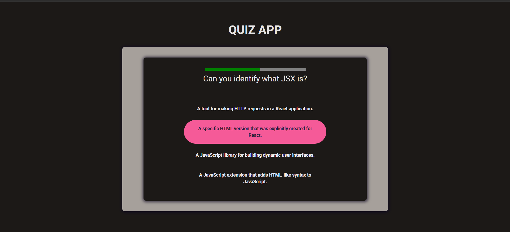
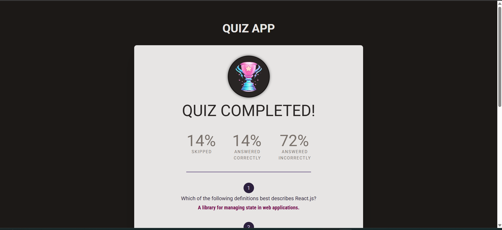

# Quiz App

A responsive quiz application built with React and Tailwind CSS. Users can take quizzes, see their scores, and track their progress in a clean, modern interface.

---

## 📸 Screenshots

### Home Page



### Complete Page



---

## Features

- Multiple-choice quizzes
- Real-time score calculation
- Responsive UI using Tailwind CSS
- Clean and modern design
- Easy to extend with more questions

---

## Technologies Used

- React – Frontend library for building UI
- Tailwind CSS – Utility-first CSS framework for styling
- React Router – Navigation between pages (if used)
- React Hooks – State management and side effects

---

## Installation

### Clone the repository:

```bash

git clone https://github.com/yourusername/quiz-app.git

cd quiz-app

npm install

npm start

```

---

## Folder Structure

```bash

quiz-app/
├── public/
├── src/
│   ├── components/
│   ├── pages/
│   ├── assets/
│   ├── App.jsx
│   └── index.jsx
├── tailwind.config.js
├── package.json
└── README.md

```
